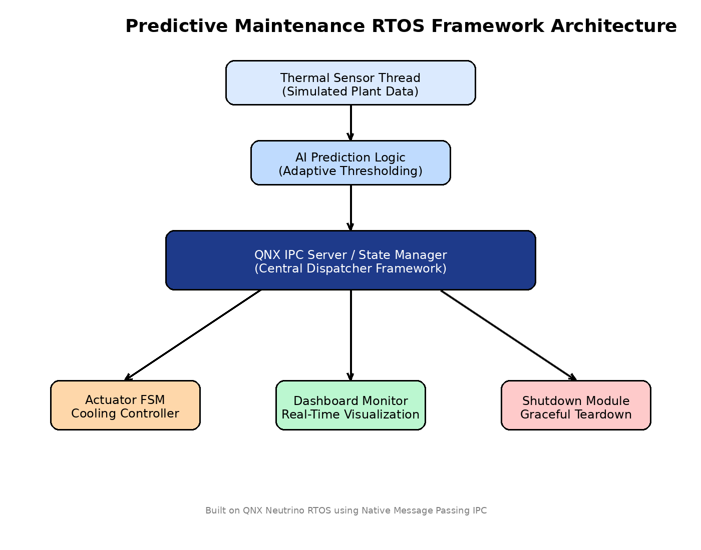

# Predictive Maintenance RTOS Framework on QNX

### Real-Time Industrial Fault Prediction and Adaptive Thermal Control Using Native QNX Neutrino IPC


## Overview

Industrial equipment failures often stem from undetected thermal anomalies, delayed actuator response, and poor real-time coordination between sensing and control modules. Traditional monitoring systems rely on periodic polling and non-deterministic communication, leading to delayed fault detection and inefficient control.

This project presents a **real-time predictive maintenance framework built on QNX Neutrino RTOS**, designed to simulate an industrial-grade adaptive monitoring and control pipeline for thermal process systems.

The framework leverages **native synchronous QNX message passing**, **priority-based real-time scheduling**, **adaptive threshold prediction**, and **finite-state actuator control** to model a deterministic predictive maintenance engine suitable for embedded industrial automation environments.

---

## Problem Statement

Modern industrial monitoring systems require:

* Deterministic low-latency inter-process communication
* Adaptive fault prediction instead of static threshold alarms
* Controlled actuator state transitions to avoid abrupt hardware switching
* Real-time scheduling of critical tasks
* Fault-tolerant shutdown and monitoring infrastructure

Conventional systems often lack one or more of these properties.

This project addresses these limitations through a modular RTOS-native architecture.

---

## Key Innovations

### Native QNX Neutrino Message Passing IPC

Implements deterministic synchronous IPC using:

* `ChannelCreate()`
* `ConnectAttach()`
* `MsgSend()`
* `MsgReceive()`
* `MsgReply()`

Unlike generic shared-memory approaches, this ensures race-free deterministic communication without explicit mutex overhead in the control path.

---

### Priority-Driven Real-Time Scheduling

Each subsystem executes with explicitly assigned real-time scheduling priorities using `SCHED_RR`:

| Module         | Priority | Purpose                                    |
| -------------- | -------- | ------------------------------------------ |
| Core Server    | 50       | Central state management / IPC arbitration |
| AI Logic       | 45       | Predictive threshold adaptation            |
| Actuator FSM   | 40       | Cooling control transitions                |
| Thermal Sensor | 30       | Sensor simulation / acquisition            |
| Dashboard      | 20       | Monitoring / visualization                 |

This ensures critical control logic preempts lower-priority visualization tasks.

---

### Finite State Machine (FSM) Based Actuator Control

Cooling actuator modeled using industrial FSM states:

```text
IDLE → ENGAGING → ACTIVE
 ^                 |
 |_________________|
```

Benefits:

* Simulates realistic actuator startup delay
* Prevents abrupt control toggling
* Mirrors industrial relay / motor startup behavior

---


### Adaptive Predictive Threshold Logic

Instead of fixed alarm thresholds, the framework continuously learns operating conditions and dynamically adjusts predictive limits.

Capabilities:

* Adaptive threshold recalibration
* Hysteresis-based alarm stabilization
* Early anomaly detection before critical failure

---

### Closed-Loop Thermal Plant Simulation

Simulates realistic industrial thermal dynamics:

* Temperature rise under uncontrolled heating
* Temperature drop during active cooling
* Fluid density variation based on thermal state

This creates a realistic closed-loop environment for control validation.

---

## System Architecture

```text
+-------------------+
| Thermal Sensor    |
+-------------------+
         |
         v
+-------------------+
| QNX IPC Server    |
| Central State Hub |
+-------------------+
   |      |      |
   v      v      v
+------+ +------+ +-------------+
| AI   | | FSM  | | Dashboard   |
| Logic| | Ctrl | | Monitoring  |
+------+ +------+ +-------------+
```
## Architecture Diagram


---

## Technical Highlights

* Multi-threaded RTOS subsystem decomposition
* Dispatcher-based modular message routing framework
* Function-pointer dispatch architecture for scalability
* Centralized deterministic state ownership model
* Graceful IPC-triggered teardown / shutdown sequence
* Live industrial dashboard console output

---

## Sample Runtime Output

```text
| TEMP   | AI THRESHOLD | VOLTAGE | DENSITY | ALARM | COOLING SYSTEM |
|--------|--------------|---------|---------|-------|----------------|
| 63.20  |    55.10     | 220.00  | 971.56  | !!!   |   ACTIVE       |
```

---

## Engineering Design Decisions

### Why Message Passing Instead of Shared Memory?

QNX Neutrino’s synchronous message passing was selected because:

* Eliminates race conditions by design
* Avoids mutex/lock overhead in critical control paths
* Ensures deterministic blocking semantics
* Better aligns with industrial QNX deployment patterns

---

### Why FSM for Actuator Control?

Real industrial actuators rarely switch instantaneously. FSM modeling allows:

* Startup/engagement delays
* Controlled transitions
* More realistic actuator emulation

---

## Future Scope

* Physical ESP32 / Sensor Integration
* CAN Bus / MQTT / OPC-UA Support
* Persistent Fault Logging to Database
* Embedded Web Dashboard / GUI
* Machine Learning Based Remaining Useful Life Prediction
* Multi-Node Distributed Monitoring Architecture

---


## Presentation
- [Project Presentation](presentations/predictive-maintenance-presentation.pptx)

## Repository Structure

```text
predictive-maintenance-qnx/
│
├── src/
│   └── predictive_maintenance.c
│
├── docs/
│   └── detailed_report.pdf
│
├── assets/
│   └── architecture_diagram.png
│
└── README.md
```

---

## Technologies Used

* QNX Neutrino RTOS
* C Programming
* POSIX Threads
* Real-Time Scheduling
* Finite State Machines
* Native QNX IPC

---

## Author

**Varshitha N B <br> Sahana G**

---

## License

Academic / Research Project
